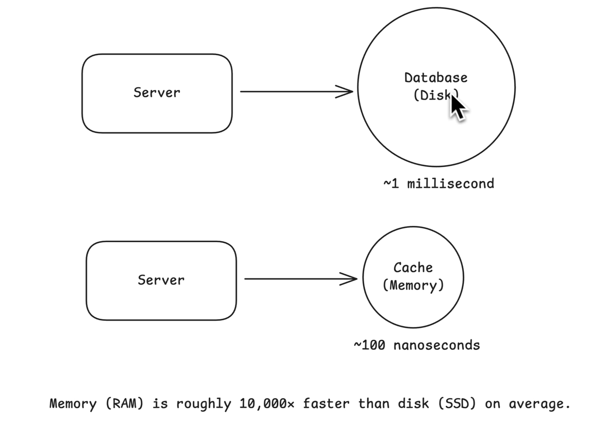

## What is Caching?

A cache is just a temporary storage that keeps recently used data handy so you can get it much faster next time.

### Caching in Memory

### Where to Cache

#### Client-side Caching

#### In-Process Caching

#### External Caching

#### Content Delivery Network (CDN)

### Cache Architecture

#### Cache-Aside

#### Read-through

#### Write-through

#### Write-behind

### Cache Eviction Policies

### Common Issues

#### Cache Stampede (Thundering Herd)

.png)

#### Cache Consistency

#### Hot Keys

